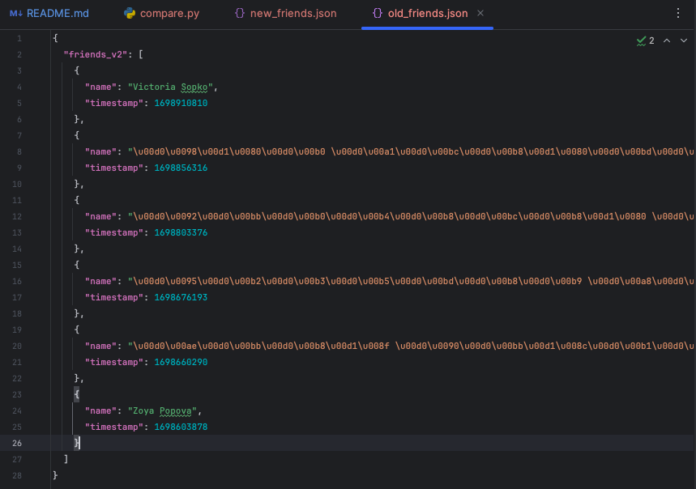
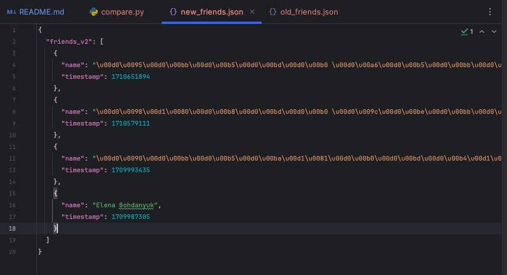
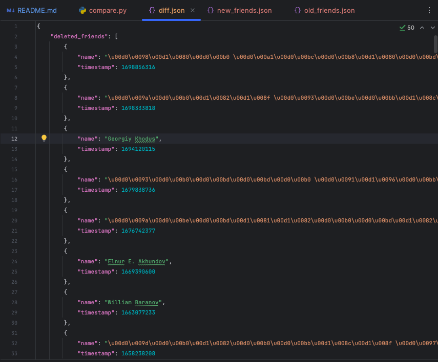
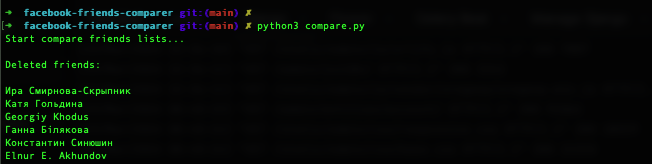
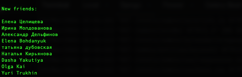

# facebook-friends-comparer

Comparison of two Facebook friend lists

### Problem:

It is necessary to compare two lists of friends from Facebook backup files in the JSON format and identify new and deleted (deleted) friends.

Old Friends List:

New Friends List:

See examples in **/examples** folder.

### Usage:

> python3 compary.py

### Result:

**diff.json** in **/data** folder

Diff List:

Console Output:

